# LekkerCook: A Culinary Journey Awaits
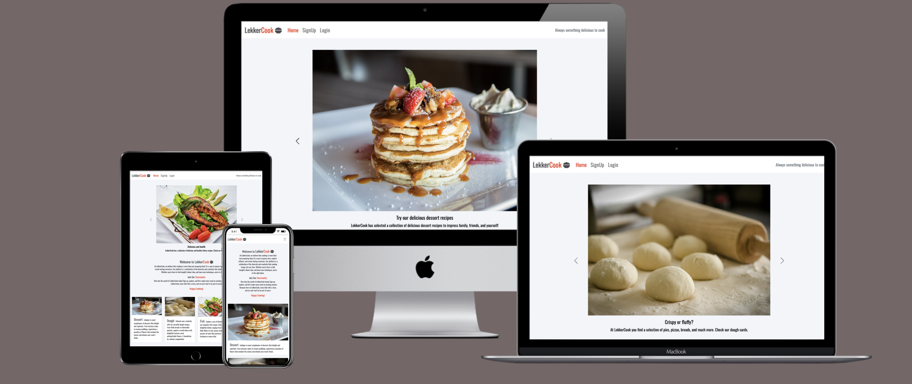
- LekkerCook is a dynamic cooking platform designed for food enthusiasts who seek a blend of flavor, and creativity. It's more than just a recipe site; it's a culinary community where passion for cooking is shared and celebrated.

## UI | UX

### Site Goals

- LekkerCook aims to achieve several key goals to enhance the culinary experience of its users:
Celebrating Culinary Diversity
We strive to represent a wide array of culinary styles, encouraging users to explore and celebrate diverse cuisines from around the world.

- Building a Cooking Community:
Our platform is designed to foster a supportive and engaging community. We aim to connect cooks of all skill levels, from beginners to experts, creating a space where knowledge and experiences are shared.

- User-Driven Experience:
We prioritize user engagement and interaction. The ability to rate, comment, and like a comment allows for a dynamic and responsive culinary experience. User feedback directly shapes the evolution of our site, ensuring a platform that resonates with our community’s needs and preferences.

- Culinary Learning and Inspiration:
We are committed to being a source of culinary inspiration. Whether it’s through detailed recipes, cooking tips, our goal is to empower users to expand their culinary skills and knowledge.

- Accessibility and Ease of Use:
LekkerCook aims to be accessible and user-friendly, offering an intuitive interface that makes discovering, and managing recipes simple and enjoyable.

### Wireframes

#### Mobile Wireframes

- These were the initial wireframes on what the mobile version was based on.

### Desktop Wireframes
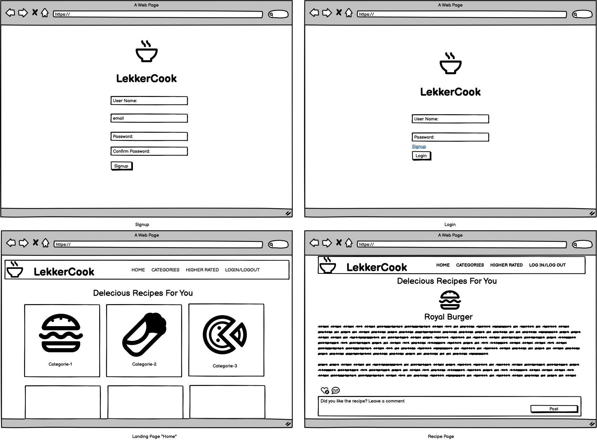
-These were the initial wireframes on what the desktop version was based on.

## Design
### Color Palette
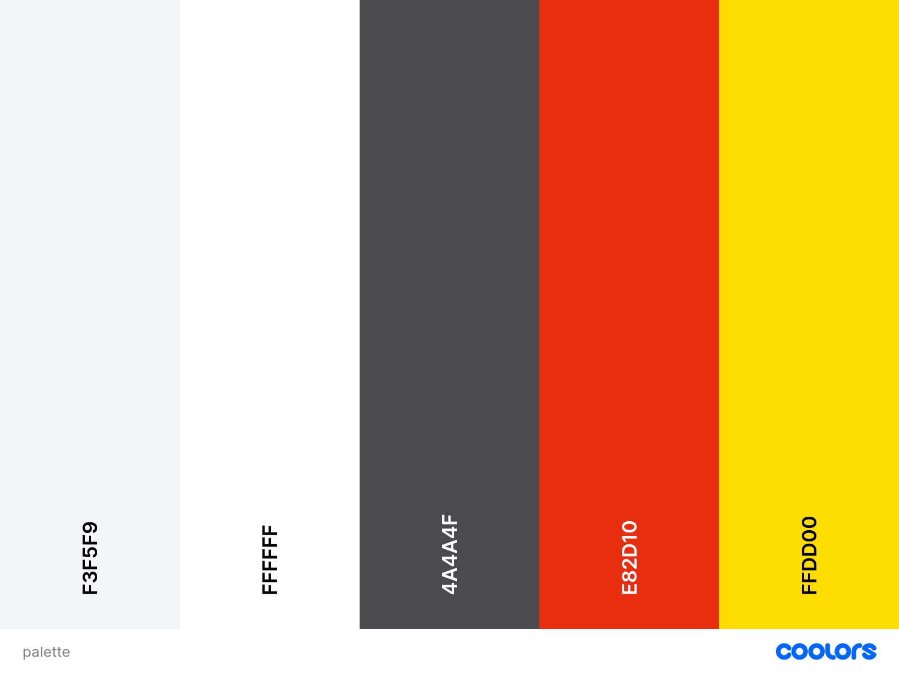 
- Background color: `#f3f5f9`
- Navbar and footer: `#ffffff` 
- Logo, footer, and body text: `#4a4a4f`
- logo: `#e82d10`
- stars: `#ffdd00`

### Typography
- Oswald

## User Stories:

- View the categories list: As a Site User, I can view a list of recipe categories so that I can choose one category of recipes.

- View the recipes list: As a Site User, I can view a list of recipes from a category so that I can select one recipe. 

- Open a recipe post: As a Site User, I can click on a recipe post so that I can read the full recipe.

- View likes: As a Site User / Admin, I can view the number of likes on each comment so that I can read the highest-rated comments

- View comments: As a Site User / Admin, I can view comments on an individual post so that I can read the conversation and read the recipe feedback from other cooking chefs

- Rate a recipe: As a Site User, I can view the recipe rating given by other users so that I can see which recipe tastes better.

- View a list of the highest-rated recipes: As a Site User / Admin, I can view a list of the highest-rated recipe posts so that I can see which is the most popular and tasty in the navigation bar.

- My favorite recipes: As a Site User, I can add a recipe to my favorites page so that I can have a list of my favorite recipes

- Account registration: As a Site User, I can register an account so that I can comment, rate recipes, and like comments from other users

- Rate a recipe: As a Site User, I can rate a recipe so that I can help other users find the best recipe

- Update and delete a post: As a Site User I can update and delete my comments so that I can correct typos or delete them if I change my mind.

- Like / Unlike: As a Site User, I can like or unlike other users comments so that I can interact with the community.

- Manage posts and images: As a Site Admin, I can create, read, update, and delete posts and images so that I can manage my blog content.

- Create drafts: As a Site Admin, I can create draft posts so that I can finish writing the content later.

- Approve comments: As a Site Admin, I can approve or disapprove comments so that I can filter out the comments.

## AGILE Development

### Database Diagram Relationship 
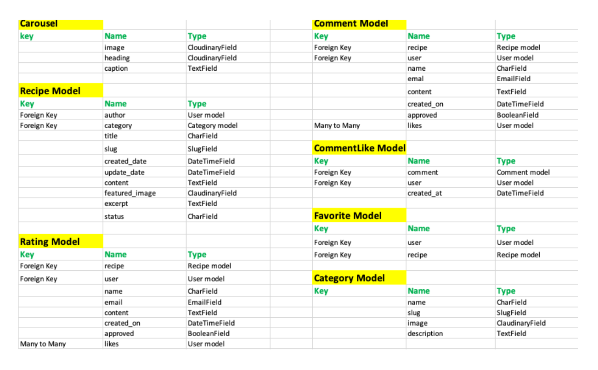

## Features:

### Home Page "Landing Page"

### logged in nav-bar
 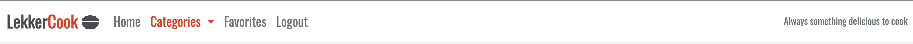
- When logged in, the nav bar shows the LekkerCook logo that, when clicked, redirects to the home page, the same behavior as the Home item; next, we have the categories dropdown menu containing all the recipes categories of the site. Next, we have the favorites
item that redirect to the user-favorites recipes page, and the log-out how the name suggests logs the user out.

### Logged out nav-bar
 
 - When logged-out, the navbar shows the login and signUp options. The favorites item is not displayed when you are not logged-in because this feature is available only to logged-in users, and all the other nav bar features behave as logged-in.

### Hamburger menu
 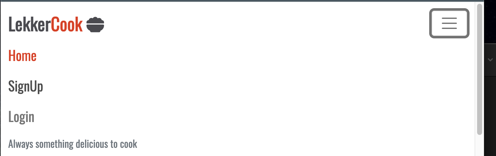
- Medium to small screens, we have the hamburger menu with the same features.

### Home Carousel
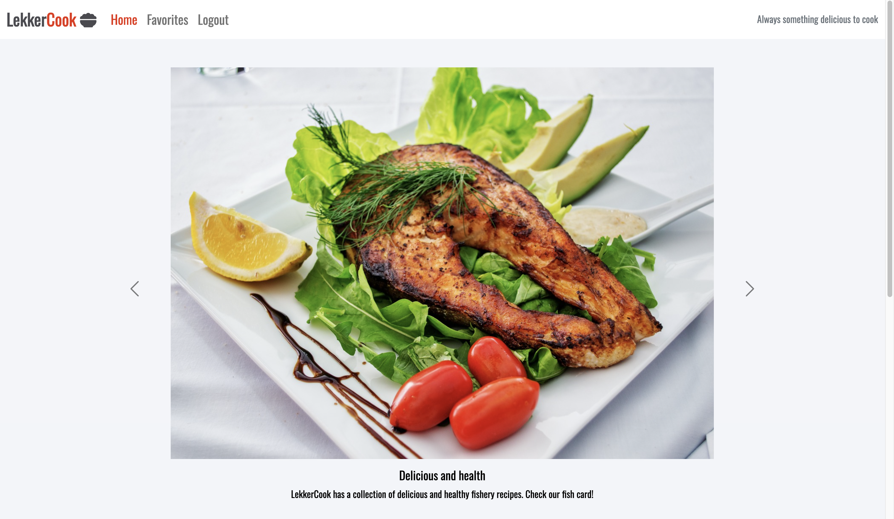
- The carousel displays sliding images with subtitles. It's intended to give the user a grasp of what is available on the site. Its content is CRUD manageable on the admin panel. The carousel is only displayed on 'Home' (landing page) and on large screens.

### Welcome message 
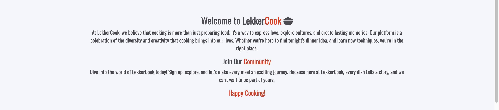
- The welcome message is a short description of LekkerCook's philosophy, features, and goals and motivates the users to sign up and join the LekkerCook community. 

### Category Cards
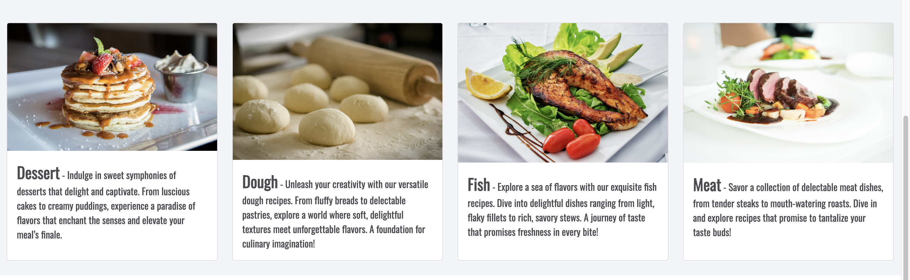
- The categorys cards divide recipes into categories, for example, meat, fish, dessert... and so on. It has an appealing image and an inspiring text that intends to instigate user curiosity and cook passion. The layout is Bootstrap responsive on small medium and large screens. The category cards are CRUD manageable on the admin panel, so new categories can be created, updated, or deleted, and the administrator has complete control over this feature.

### Category Cards Small Screens
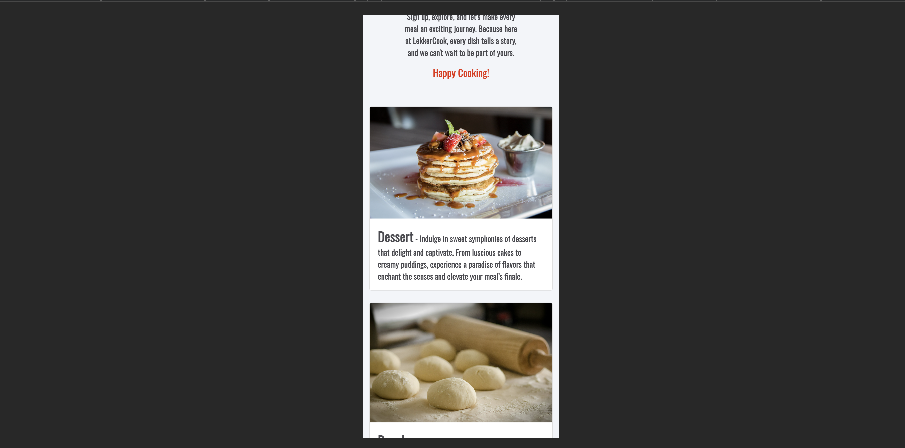
- An example of the cards on a small screen device

### Footer
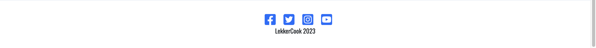
- The footer is simple; it has social media links where users can interact and make contact, letting us know what is in the user's mind and helping us to develop an even better solution.

### Category Page
- Desktop
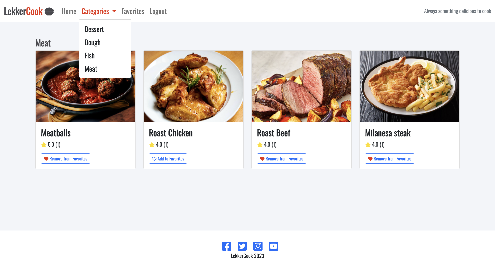
- Medium Screen
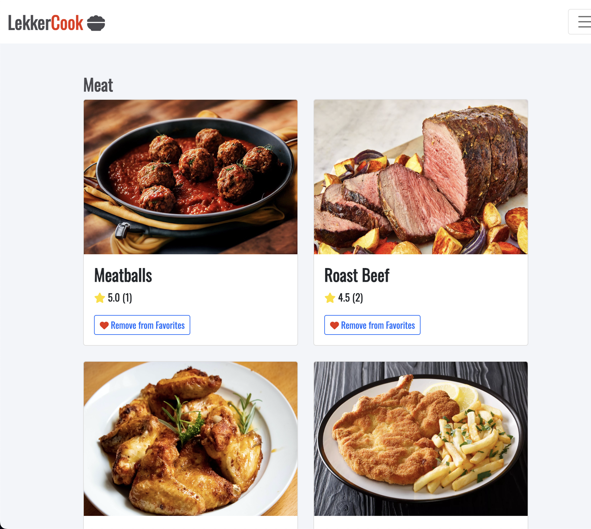

- The Meat category was chosen as a recipe category example. It shows a list of recipes based on meat. Each recipe is a card, like the category, with an image rating average and a favorite toggle button that adds the recipe to the user's favorite page, filing the heart icon with the red color when activated, press again the heart icon will be hollow with a blue outline and the recipe will be removed from the favorites; the favorite button is present on the recipe page as well; if you want to change the category, a category dropdown menu is displayed on the navbar for easy access to the category content, avoiding the necessity of returning to the category cards on the home page. Obs. The Category dropdown menu is not displayed on the home-page "landing page" to encourage the user to scroll down to the cards and navigate the content, but it is displayed on all other site pages. All the categories' content is CRUD manageable on the admin panel and is displayed dynamically when you create, update, or delete category content.

### Recipe Page
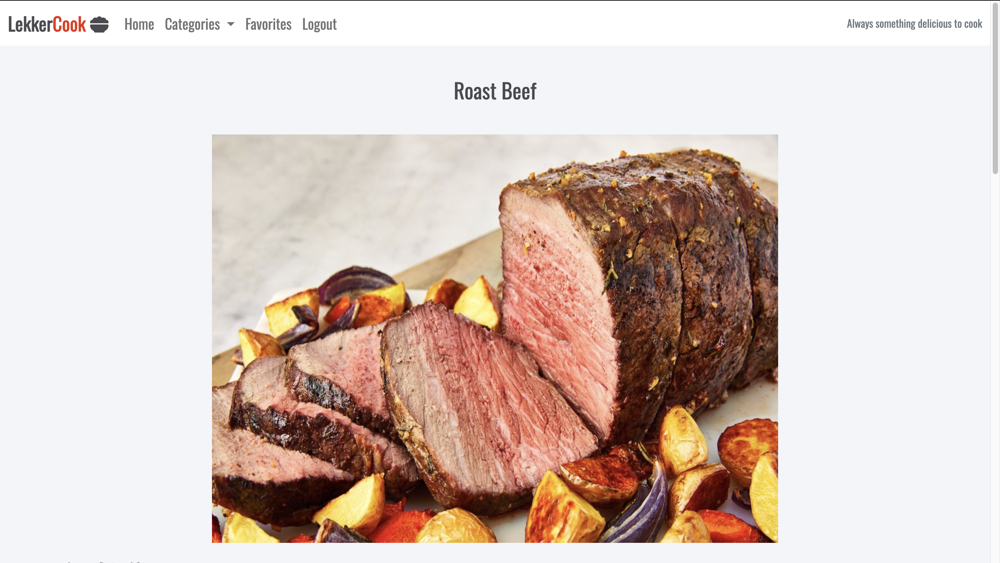

- To access any of the recipes and their functionalities described in this section, the user must sign up and log in. If the user tries to access without logging in, the user is redirected to the log-in page. At the top of the page, we have the recipe title, and below, we Have a high-definition recipe hero image that illustrates the recipe.

#### Recipe Rating and Recipe Text
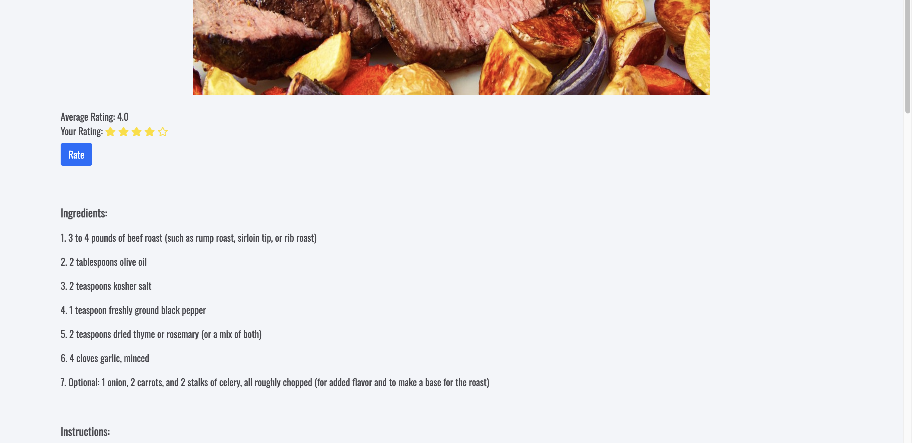
- Below the recipe image, we have the average rating score followed by the rating star icons that color it dynamically by the user click; when the number of stars that the user wishes to give to the recipe is selected, the next step is to click in the blue "rate button," and the average rating is calculated and updated without reloading the page thanks to the "ajax" javascript code. And below the rating, we find the actual recipe text content.

### Add to Favorites
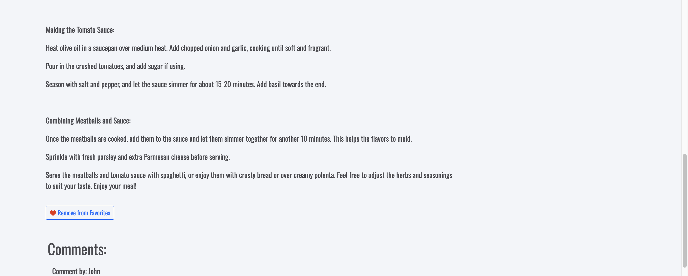
- Bellow the recipe and above the comments, we find the favorite button; the functionality has been described in the (Category Page section) resuming it is a toggle button that ads and removes the recipe from the user's favorite page

### Recipe Comment
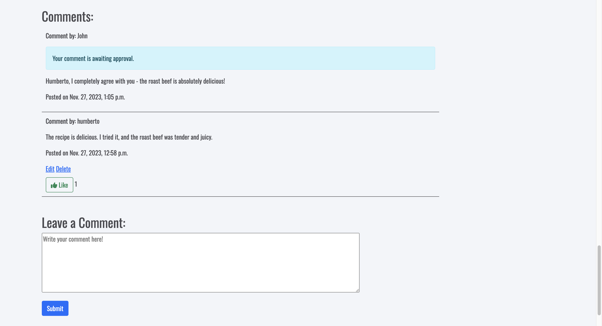
- Below the recipe, we find the comments section with the user's comments for this specific recipe; when the user submits a new comment, a message is displayed. Warning: The comment is awaiting the administrator's approval; when the approval is given, any user can leave a like in the comment.

### Recipe Edit and Delete Comment
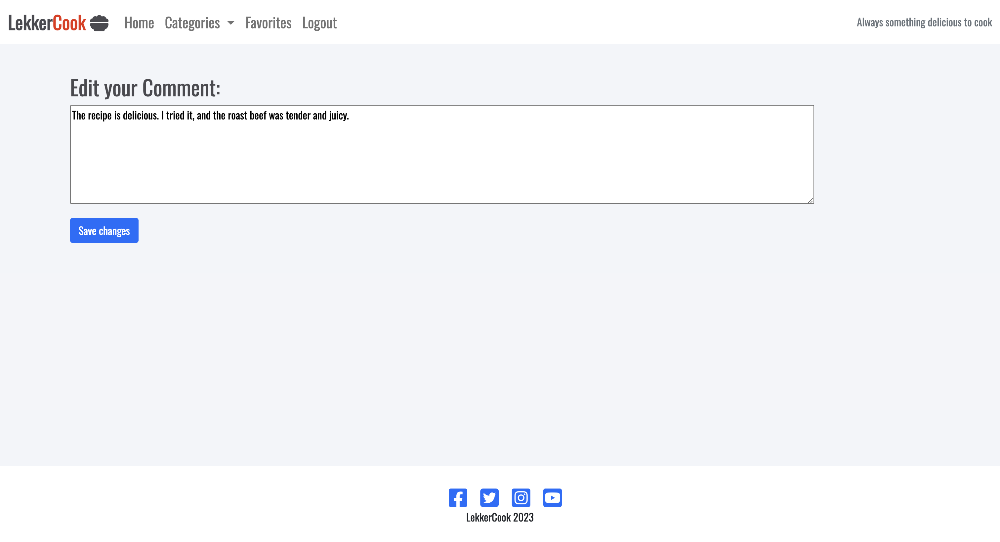
- If the user wishes, he can delete or edit the comment at any time. If the comment is edited, it has to be approved by the administrator again, even if the comment was previously approved.

### User Favorites

- The user favorites is a page where the user can add or remove his favorite recipes represented by the "recipe cards" that have been described in the (Category Page); When the user clicks one of the recipe cards, it opens the page with the respective recipe, when you want to remove from favorites there is a "Remove from favorites" button.

### Mobile Favorites
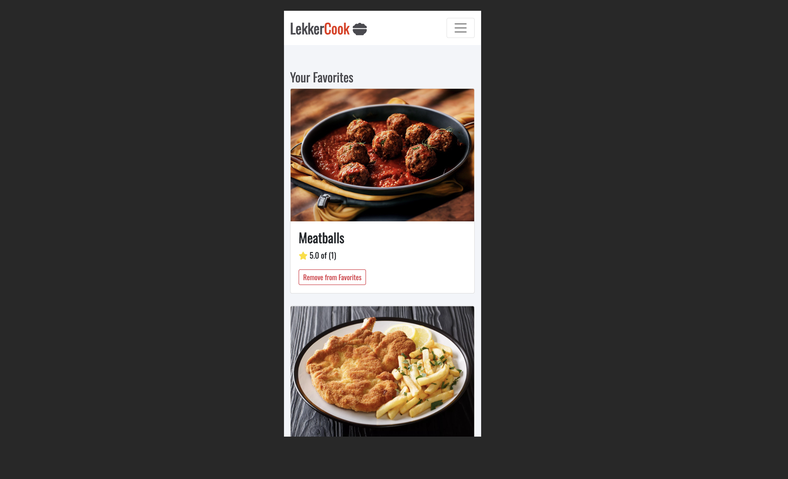
- The favorite page, like all LekkerCook pages, are fully bootstrap responsive in small, medium, and large screens

### Log in | signUp
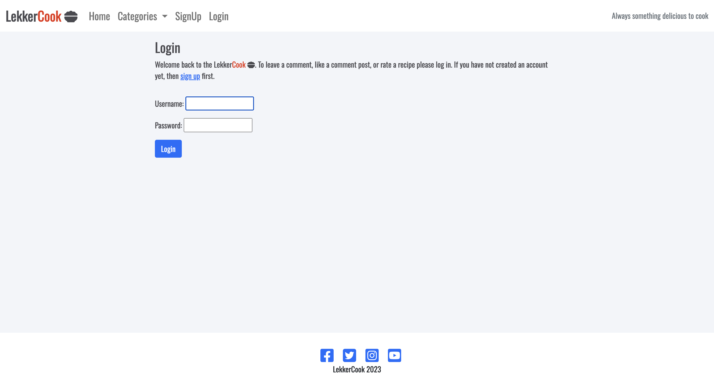
- Here, we have a simple, straightforward login page with a welcome message and a link to signUp

#### Sign Up
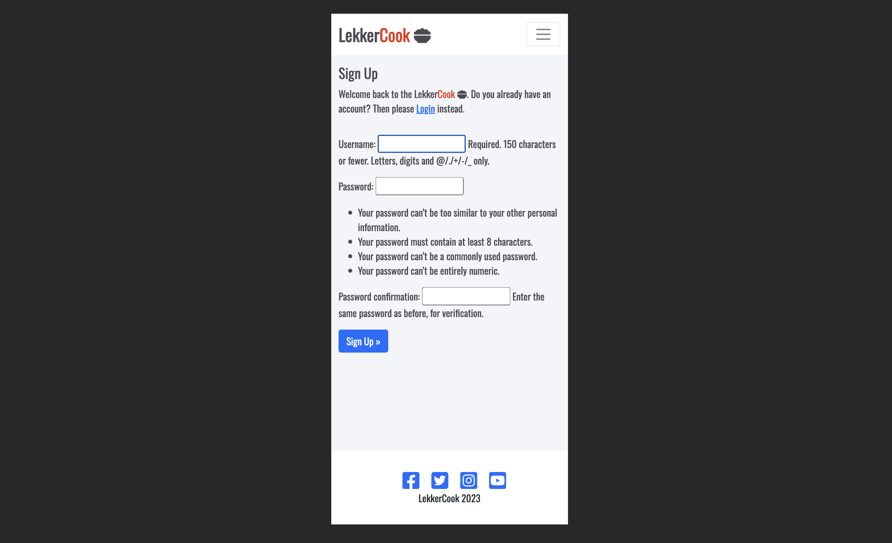
- Here is the Mobile signUp page 

## Testing

### Manual Testing 

### Testing User Stories

## Validator Testing
- HTML
- No errors were returned when passing through the official [W3Cvalidator](https://validator.w3.org/nu/?doc=https%3A%2F%2Flekker-cook-00ac4ef685fa.herokuapp.com%2F)
- CSS
- No errors were found when passing through the official [jigsaw validator](https://jigsaw.w3.org/css-validator/validator?uri=https%3A%2F%2Flekker-cook-00ac4ef685fa.herokuapp.com%2F&profile=css3svg&usermedium=all&warning=1&vextwarning=&lang=pt-BR)

## Deployment

## Citation Sources

#### Credits 

#### Content

#### Media

## AGILE Development